# Entra ID Benutzer-Schema – Überblick

Diese Seite visualisiert die wichtigsten Informationsbereiche, die wir für Benutzer aus Microsoft Entra ID (Microsoft Graph) synchronisieren bzw. anzeigen. Das Diagramm dient als Referenz für Backend- und Frontend-Implementierungen (HR-Modul, DataSources/Integrations).

```mermaid
graph TD
    A["Microsoft Entra ID User"] --> B["👤 Persönliche Informationen"]
    A --> C["🏢 Organisation"]
    A --> D["📞 Kontakt"]
    A --> E["📍 Adresse"]
    A --> F["🔧 Technische Details"]
    A --> G["📄 Lizenzen & Apps"]
    A --> H["🔄 On-Premises Sync"]
    A --> I["📝 Über mich"]

    B --> B1["Vorname givenName"]
    B --> B2["Nachname surname"]
    B --> B3["Mitarbeiter-ID employeeId"]
    B --> B4["Benutzertyp userType"]

    C --> C1["Abteilung department"]
    C --> C2["Position jobTitle"]
    C --> C3["Unternehmen companyName"]
    C --> C4["Anstellungsart employeeType"]
    C --> C5["Kostenstelle costCenter"]
    C --> C6["Geschäftsbereich division"]
    C --> C7["Vorgesetzter manager"]

    D --> D1["Mobil mobilePhone"]
    D --> D2["Telefon businessPhones"]
    D --> D3["Fax faxNumber"]
    D --> D4["Büro officeLocation"]

    E --> E1["Straße streetAddress"]
    E --> E2["Stadt city"]
    E --> E3["PLZ postalCode"]
    E --> E4["Bundesland state"]
    E --> E5["Land country"]

    F --> F1["Sprache preferredLanguage"]
    F --> F2["Standort usageLocation"]
    F --> F3["Erstellt createdDateTime"]
    F --> F4["Letzte Anmeldung lastSignInDateTime"]
    F --> F5["Account aktiviert accountEnabled"]

    G --> G1["Zugewiesene Lizenzen assignedLicenses"]
    G --> G2["Zugewiesene Pläne assignedPlans"]

    H --> H1["Domäne onPremisesDomainName"]
    H --> H2["SAM Account onPremisesSamAccountName"]
    H --> H3["Sync aktiviert onPremisesSyncEnabled"]
    H --> H4["Distinguished Name onPremisesDistinguishedName"]

    I --> I1["Freitext aboutMe"]

    style A fill:#667eea,stroke:#333,stroke-width:2px,color:#fff
    style B fill:#f0f9ff,stroke:#0369a1,stroke-width:1px
    style C fill:#f0fdf4,stroke:#166534,stroke-width:1px
    style D fill:#fef7ff,stroke:#86198f,stroke-width:1px
    style E fill:#fef3c7,stroke:#92400e,stroke-width:1px
    style F fill:#f3e8ff,stroke:#7c3aed,stroke-width:1px
    style G fill:#ecfdf5,stroke:#059669,stroke-width:1px
    style H fill:#fef2f2,stroke:#dc2626,stroke-width:1px
    style I fill:#f8fafc,stroke:#64748b,stroke-width:1px
```

Hinweis:
- Quelle: Microsoft Graph `/v1.0/users` (+ `$expand=manager`) gemäß Implementierung in `backend/src/datasources/entraac/sync.ts`.
- Konsumiert durch HR-Frontend (`EmployeesPage.tsx`) im Detail-Panel.

